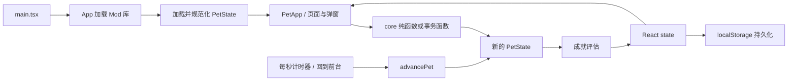

# PocPet CodeWiki

本文是 PocPet 的长期代码地图和开发约定，面向维护者与后续代码代理。功能事实以代码为准；临时实施计划在功能落地后不继续保留，仍有长期价值的约束应合并到本文或对应用户指南。

当前代码快照版本为 `1.4.5`。版本发布前应重新核对根目录 `package.json`、`src-tauri/tauri.conf.json` 与 `src-tauri/Cargo.toml`。

## 1. 项目定位与技术栈

PocPet 是一个离线优先的虚拟宠物应用，同时面向 Windows、Android 和 Web。前端承担主要业务逻辑与本地数据管理，Tauri 负责桌面/移动端容器及文件对话框、文件系统和外部链接等平台能力。

- UI：React 18、TypeScript、Lucide React。
- 构建：Vite 6。
- 原生容器：Tauri 2、Rust。
- 本地状态：`localStorage`。
- Mod 素材：IndexedDB；Mod 清单和启用状态保存在本地存储中。
- 国际化：`src/i18n/zh-CN.json` 与 `src/i18n/en-US.json`。
- 样式：原有 `src/styles.css` 加按功能拆分的 `src/styles/*.css`。

应用没有后端、账号、云存档、支付或联网抽卡。随机玩法和每日结算均在本地完成。

## 2. 目录地图

```text
PocPet/
|- src/
|  |- core/          领域类型、规则、迁移、存档、Mod、音频
|  |- ui/            页面、弹窗和展示组件
|  |  `- app/        App 使用的导航与业务 controller hooks
|  |- styles/        拆分后的主题和功能样式
|  |- i18n/          双语资源与翻译函数
|  |- platform/      Web/Tauri 平台差异封装
|  |- mods/          仓库内置示例 Mod
|  |- assets/        图片与音频资源
|  `- main.tsx       React 入口
|- src-tauri/        Tauri/Rust、权限、图标和 Android 工程
|- scripts/          专项规则检查和打包脚本
|- docs/             长期开发文档与 Mod 指南
|- release/          本地交付产物，不提交 Git
`- dist/             Vite 构建输出
```

常用入口：

- `src/main.tsx`：挂载 React 并按固定顺序加载样式。
- `src/ui/App.tsx`：加载 Mod 与存档，组合页面/弹窗，连接 UI 事件和领域函数。
- `src/core/pet.ts`：领域层公共出口；UI 优先从这里导入类型和规则。
- `src/core/petTypes.ts`：`PetState` 及各子系统持久化结构。
- `src/core/petState.ts`：默认存档、主存档规范化和跨版本迁移。
- `src/core/petLifecycle.ts`：时间推进、离线结算、状态衰减与恢复。
- `src/core/storage.ts`、`src/core/saveCodec.ts`：内部存储和外部导入导出。

## 3. 运行时数据流



启动顺序如下：

1. `App` 先读取 Mod 库并加载当前启用 Mod。
2. 根据当前 Mod 构建邻居与可赠送道具上下文，再读取 `pocpet.pet.v1`。
3. 存档通过 `normalizePet` 和 `advancePet` 恢复到当前时间；无存档时进入角色选择。
4. `usePetSession` 每秒调用一次 `advancePet`，窗口重新可见时立即补一次推进。
5. React 状态变化后写回本地存储；成就解锁统一在 `commitPet` 中评估。

领域操作通常接收旧 `PetState` 并返回新对象。涉及扣款、奖励、计数、随机游标或保底的结算必须一次返回完整新状态，不能由 UI 分多次修改。需要防止同一渲染帧重复点击时，沿用 `petRef` 加同步保存的现有模式。

## 4. 领域模块

| 模块 | 责任 |
|---|---|
| `petTypes.ts` | 定义主状态、背包、花园、日程、扭蛋、成就、终局等结构 |
| `petState.ts` | 创建默认宠物，校验旧值，执行兼容迁移和一次性补偿 |
| `petStats.ts` | 等级、属性上限、升级成本、数值钳制和恢复间隔 |
| `petActions.ts` | 喂食、清洁、睡眠、打工、购买、升级、番茄钟等主动操作 |
| `petLifecycle.ts` | 时间推进、离线事件、自然恢复、自动睡眠和每日遭遇 |
| `items.ts` | 内置道具、商店、背包 registry 与 Mod 道具合并 |
| `pomodoro.ts` | 番茄钟状态、阶段时长和奖励计算 |
| `dailyReset.ts` | 每日 05:00 边界和旧日期键兼容 |
| `dailyWishes.ts` | 每日愿望与回归任务 |
| `dateRewards.ts` | 生日、相遇纪念日、节日、月初与登录奖励 |
| `garden.ts` | 花园 schema、树木、工具、照料、成熟和收获 |
| `partnerSchedule.ts` | 候选板、活动快照、技能、结算与迁移 |
| `partnerScheduleEffects.ts` | 日程技能与大师效果 selector |
| `boostCards.ts` | 好友证/挚友证、每日领取和增益消耗 |
| `goldenAppleGacha.ts` | 确定性 RNG、奖池、支付、保底和最近结果 |
| `classicEndgame.ts` | 共同目标、投入、阶段完成、纪念等级和苹果兑换 |
| `classicTrophies.ts` | 奖杯派生状态及跨系统效果 |
| `achievements.ts` | 成就定义、计数、解锁、领取和统计派生 |
| `mod.ts` | Mod zip 与 manifest 解析、约束和运行时模型 |
| `modStorage.ts` | Mod 库、IndexedDB 图片、对象 URL 生命周期 |
| `saveCodec.ts` | 外部存档封装、校验、兼容读取和时间基线重置 |
| `audio.ts` | BGM/SFX 加载、解锁、静音和页面模式同步 |

`src/core/pet.ts` 是公共门面。新增公共能力时在原模块实现并从这里显式导出，避免 UI 深度依赖内部模块。

## 5. 状态、存档与兼容

### 5.1 主状态

`PetState` 是唯一主游戏状态，子系统状态直接挂在其下。新增持久化字段需要同时完成：

1. 在 `petTypes.ts` 定义类型与 schema 字段。
2. 在对应 `default*State` 中给出默认值。
3. 在对应 `normalize*State` 中处理缺字段、非法值和旧 schema。
4. 在 `normalizePet` 中接入子状态。
5. 增加旧存档、非法输入和重复加载的专项检查。

不要直接信任 `localStorage`、外部存档或 Mod 数据。数字必须处理 `NaN`、负数、越界和非整数；数组必须去重并限制长度；未知枚举值应回退或丢弃，不能让整个存档无法加载。

### 5.2 内部存储

- 主存档键：`pocpet.pet.v1`。
- 语言键：`pocpet.language`。
- Mod 库状态：`pocpet.mod.library.v1`。
- Mod 图片数据库：`pocpet-mods` IndexedDB。

主存档键名保持 `v1` 不代表所有子系统都停留在 schema v1。花园、伙伴日程、扭蛋、增益卡、共同目标等分别维护自己的 schema。

### 5.3 外部存档

外部存档由 `saveCodec.ts` 生成带版本的文本，包含主状态和当前 Mod 摘要，但不包含 Mod 图片。当前文本带校验和与可逆变换，用于损坏检测和避免直接误改，不是加密，也不能承载秘密。

导入时会重置离线时间、能量恢复、睡眠和番茄钟等时间基线，避免恢复旧备份后立即产生大量离线结算。来自更高 schema 的存档应明确拒绝并提示升级。

### 5.4 迁移原则

- 迁移必须幂等：同一存档重复加载不能重复退款、发奖或计数。
- 一次性补偿使用稳定的 `claimedRewardIds` 标识。
- 运行时可由现有状态派生的数据不要重复持久化。
- 正在进行的日程、扭蛋结果等应保存结算快照，后续数值调整不追溯改变旧结果。
- 删除字段前至少保留一个可读取旧字段的迁移周期。
- 导出格式、Mod 格式和用户生成内容必须保留 `schemaVersion`、验证规则与失败处理。

## 6. 时间边界

项目存在两类日期，不能混用：

- 游戏日：使用 `getDailyResetDateKey`，每天本地时间 05:00 刷新。每日愿望、日程板、商店折扣、邻居礼物、扭蛋券来源等使用此边界。
- 自然日：生日、相遇纪念日、固定节日、月初礼物和季节按本地日历日期计算。

不要自行用 `new Date().toDateString()` 新建每日键。新增日常玩法统一复用 `dailyReset.ts`；现实纪念日则复用 `dateRewards.ts` 的日历工具。系统时间回拨时应保守保留已领取或已判定状态，避免重复收益。

## 7. UI 结构

### 7.1 页面与导航

`useAppNavigation` 管理两类表面：

- 页面：`home`、`achievements`、`garden`、`partnerSchedule`、`commonDreams`。
- 工具弹窗：`inventory`、`shop`、`boostCards`、`gacha`、`settings`。

`App.tsx` 当前仍是主要编排层。新的复杂业务优先写入 `core` 或 `ui/app` controller hook，不要继续把规则计算堆到 JSX 事件中。

### 7.2 弹窗

新弹窗应复用 `DialogShell`。它负责：

- `role="dialog"`、`aria-modal` 和标题关联。
- 打开后聚焦、Tab 焦点循环、关闭后恢复焦点。
- 多层弹窗栈，只允许最上层响应 Esc。
- 弹窗存在时锁定页面滚动，并在最后一个弹窗关闭后恢复。

背包、商店、设置、增益卡、花园操作和扭蛋已经复用这一模式。`ConfirmDialog` 与 `App.tsx` 内少量直接写 backdrop 的弹窗仍是旧实现，后续修改到这些区域时应迁移，避免继续复制新的弹窗骨架。

### 7.3 样式加载

`src/styles/index.css` 先加载历史 `src/styles.css`，再加载 tokens、base 和各功能样式。后加载的模块化 CSS 会覆盖旧规则。修改样式前必须同时搜索旧文件和模块文件，避免只改到被覆盖的一份。

新样式优先写入对应 `src/styles/*.css`。全局 token 放在 `tokens.css`，基础元素放在 `base.css`，不要继续扩张 `styles.css`。

## 8. 低版本 WebView 兼容规范

背包、商店、设置、确认框、扭蛋详情以及后续所有弹窗都必须兼容项目支持范围内的较低版本 WebView。当前仓库尚未记录一个可验证的最低 WebView 版本，因此不能只凭桌面 Chrome 正常显示就判定兼容；在建立设备矩阵前，关键布局一律采用“旧语法基线 + 现代能力渐进增强”。

### 8.1 JavaScript 与浏览器 API

- `tsconfig.json` 当前语法目标为 `ES2020`，`vite.config.ts` 没有显式 `build.target`。转译不会自动补齐浏览器 API。
- 不直接依赖 `structuredClone`、`crypto.randomUUID`、`Array.prototype.at`、`Object.hasOwn`、原生 `<dialog>` 等较新的 API。确需使用时先做能力检测并提供等价回退，或明确配置构建目标与 polyfill。
- 文件保存、外链、对话框等平台差异必须放在 `src/platform` 或 Tauri 插件封装中，保留普通 Web 下载回退。
- 不使用仅靠 hover 才能完成的操作；触摸设备必须能点击、滚动和关闭。

### 8.2 CSS 基线与增强

关键尺寸先写传统单位，再用 `@supports` 覆盖：

```css
.example-dialog {
  width: calc(100% - 32px);
  max-width: 680px;
  max-height: calc(100vh - 32px);
  overflow-y: auto;
}

@supports (height: 100dvh) {
  .example-dialog {
    max-height: calc(100dvh - 32px);
  }
}
```

固定遮罩保留边缘属性回退：

```css
.modal-backdrop {
  position: fixed;
  top: 0;
  right: 0;
  bottom: 0;
  left: 0;
  inset: 0;
}
```

以下能力只能作为增强，不能成为关键内容可见、可滚动或可点击的唯一条件：

- `dvh/svh`、`min()`、`max()`、`clamp()`。
- `backdrop-filter`、`color-mix()`、container query。
- `aspect-ratio`、flex `gap`、`overflow-wrap: anywhere`、`overscroll-behavior`。
- `env(safe-area-inset-*)`。

使用这些能力时先给出普通宽高、实体背景、边距、换行或安全区为 0 的回退。装饰性模糊失效可以接受，弹窗消失、按钮越界和列表无法滚动不可接受。

### 8.3 弹窗布局规则

- 桌面可以由内容列表滚动；窄屏优先让整个弹窗成为唯一纵向滚动容器，避免 backdrop、弹窗和列表三层嵌套滚动。
- flex/grid 滚动子项必须设置 `min-width: 0` 或 `min-height: 0`，长 Mod 名称、英文单词和大数值必须换行或省略。
- 弹窗高度同时提供 `100vh` 回退和 `100dvh` 增强，并计入顶部/底部安全区。
- 移动端滚动容器保留 `-webkit-overflow-scrolling: touch`；需要时设置 `touch-action: pan-y`。
- 操作按钮不能依赖 `position: sticky` 才可到达；即使 sticky 失效，也应能通过正常滚动看到。
- 禁止用固定内容高度假设文案长度。中文、英文、Mod 自定义名称和系统字号放大后仍需可用。
- 二级弹窗必须继续使用弹窗栈，关闭详情后焦点返回原入口。

背包是弹窗兼容的基准实现：窄屏下切换为单一弹窗滚动，内部列表取消独立滚动，道具行改成两列并让操作按钮换行。以后新增弹窗或改动背包时应保留这一退化路径。

### 8.4 兼容验证清单

每次修改弹窗至少检查：

1. 420px 桌面窗口和约 390px 手机宽度。
2. 短列表、长列表、空状态和最长中英文/Mod 文案。
3. 仅支持 `vh`、不支持 `dvh` 时仍可完整打开和滚动。
4. `backdrop-filter`、container query、`color-mix()` 失效时内容仍清楚。
5. 软键盘打开、系统字号放大和安全区存在时，关闭与主操作仍可到达。
6. 单层与二级弹窗的 Esc、Tab、返回键、滚动锁和焦点恢复。
7. 触摸滚动不带动背后页面，关闭后页面滚动恢复。

若要承诺某个具体旧 WebView 版本，应先把该版本写入测试矩阵，并在对应 Android 模拟器或真机上完成一次聚焦验证；不要仅通过修改 TypeScript target 宣称兼容。

## 9. Mod 系统

Mod zip 解析与运行时限制见：

- 中文：[Mod 制作指南](./mod制作指南.md)
- English: [Mod Guide](./mod-guide.md)

代码侧主要边界：

- `mod.ts` 负责白名单路径、manifest 字段、图片大小和自定义道具验证。
- `modStorage.ts` 最多保留 12 个完整 Mod，图片 Blob 存 IndexedDB。
- 自定义道具必须使用 `{modId}:{localId}` 命名空间。
- 存档保留缺失 Mod 的道具数量，但未重新导入对应 Mod 前不可使用或购买。
- 外部存档只包含当前 Mod 摘要，不包含 Mod 库和图片。

新增 Mod schema 时必须继续读取 v1/v2，限制未知文件、路径穿越、过大资源和危险字段；不能让 Mod 改写金币、存档迁移、随机概率等核心规则。

## 10. 国际化与资源

- 所有用户可见业务文案同时更新 `zh-CN.json` 与 `en-US.json`。
- `t` 返回标量文案，`list` 返回数组，`pick` 用于候选文案。
- JSON key 应按功能域归类，不在组件中复制大段双语常量。
- 图片通过 `assets.ts` 和 Mod resolver 获取；不要在组件中拼接资源路径。
- Mod 可覆盖的资源必须同时更新解析白名单和两份制作指南。
- 音频新增后在 `audio.ts` 注册，遵守用户手势解锁与页面隐藏静音行为。

## 11. 常见开发流程

### 新增持久化玩法

1. 在独立 core 模块定义规则和纯函数。
2. 更新类型、schema、默认状态与 normalize。
3. 从 `pet.ts` 导出公共 API。
4. 在 controller hook 或 `App.tsx` 编排调用，UI 只提交意图。
5. 同步双语文案、样式和帮助内容。
6. 增加专项脚本，覆盖迁移、边界、重复点击和原子结算。

### 新增道具

1. 更新 `BuiltinItemId` 与 `items.ts` 定义。
2. 添加图标并更新 `assets.ts`。
3. 确认商店、背包、奖励池、成就与 Mod override 是否需要纳入。
4. 更新中英文 Mod 指南的允许图片列表。
5. 验证旧存档、未知道具与缺图回退。

### 新增弹窗

1. 使用 `DialogShell` 和稳定的 `labelId`。
2. 明确一级/二级弹窗关系和关闭后的焦点目标。
3. 先写低版本 WebView 可用的尺寸、滚动与背景，再添加现代 CSS 增强。
4. 同时验证桌面、窄屏、长文案、空状态和减少动态效果。

## 12. 验证与打包

依赖已安装时，文档或代码交付前至少运行相关项：

```powershell
npm.cmd run build
npm.cmd run check:date-rewards
npm.cmd run check:garden-care
npm.cmd run check:gacha
npx.cmd tsx scripts/check-partner-schedule.ts
git diff --check
```

按改动范围选择专项检查，不要求每个小改动都跑所有脚本。存档、共享规则或跨系统奖励变更应扩大验证范围。

打包命令与产物约定见根目录 `README.md` 和 `AGENTS.md`。日常只生成 Windows x64 与 Android arm64 测试包；`x.y.0` 或用户明确要求时才触发全量构建。Android 测试包默认使用 debug keystore，`release/` 不提交 Git。

## 13. 文档维护

`docs/` 长期保留以下三类内容：

- `CODEWIKI.md`：当前架构、兼容约束和开发入口。
- `mod制作指南.md`：中文 Mod 作者指南。
- `mod-guide.md`：英文 Mod 作者指南。

大型任务可在开发期间创建中文实施计划，但完成后应执行以下之一：

- 删除已失效的阶段、待办和临时数值推导；历史仍可从 Git 查看。
- 把仍然有效的 schema、兼容性或维护约束合并进 CodeWiki。
- 把用户需要长期查阅的格式与工作流合并进对应用户指南。

不要让已经完成的实施计划与代码长期并存，否则后续维护者无法判断哪一份才是事实来源。
